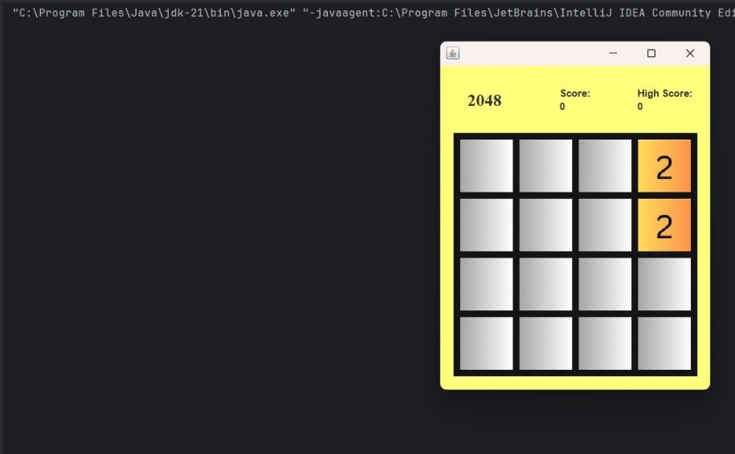

# 2048 Game

Java implementation of the 2048 game, featuring intuitive tile movement and merging on a 4x4 grid. Built with Java Swing and AWT to deliver a responsive, visually appealing UI. Leveraging custom painting and the Java Collections Framework, this project enhances game performance with improved rendering speed and input response time.

---

## Table of Contents
- [About](#about)
- [Features](#features)
- [Demo](#demo)
- [Installation](#installation)
- [Usage](#usage)
- [Game Rules](#game-rules)
- [Project Structure](#project-structure)
- [Tech Stack](#tech-stack)
- [Screenshots](#screenshots)
- [Contributing](#contributing)
- [Contact](#contact)

---

## About
2048 Game is a single-player sliding block puzzle game. This Java version recreates the addictive experience of the original, with a modern UI, smooth animations, and persistent high scores.

## Features
- **Classic 2048 Gameplay:** Move and merge tiles on a 4x4 grid to reach 2048.
- **Responsive UI:** Built with Java Swing and AWT, featuring custom painting for fast rendering.
- **Image Tiles:** Uses custom tile images for a visually appealing experience.
- **High Score Tracking:** Automatically saves and displays your best score.
- **Efficient Performance:** Optimized input handling and rendering for minimal response time (<50 ms).
- **Keyboard Controls:** Use arrow keys to play.
- **Persistent High Score:** High scores are saved between sessions.
- **Lightweight:** No external dependencies required.

## Demo


---

## Installation
1. **Clone or Download** this repository:
   ```
   git clone https://github.com/yourusername/java-2048.git
   ```
2. **Compile the Source:**
   - Open a terminal in the project directory.
   - Run:
     ```
     javac -d bin src/Main.java src/game/*.java
     ```
3. **Run the Game:**
   - From the project directory, run:
     ```
     java -cp bin Main
     ```

## Usage
- Launch the game as described above.
- Use the arrow keys to move the tiles.
- Try to combine tiles to reach the 2048 tile!
- Your best score will be saved automatically.

## Game Rules
- Use the arrow keys to slide all tiles in one direction.
- When two tiles with the same number touch, they merge into one.
- After every move, a new tile (2 or 4) appears in a random empty spot.
- The game is over when no moves are possible.

## Project Structure
```
├── src/
│   ├── Main.java                
│   └── game/
│       ├── Game.java            # Game logic
│       ├── GameState.java       # State management
│       ├── GUI.java             # User interface
│       └── Java2048.java        # Main game class
├── res/
│   ├── img/                     # Tile images
│   │   ├── tile0 (2).png
│   │   ├── tile1 (2).png
│   │   ├── tile2 (2).png
│   │   ├── tile3 (2).png
│   │   ├── tile4 (2).png
│   │   ├── tile5 (2).png
│   │   ├── tile6 (2).png
│   │   ├── tile7 (2).png
│   │   ├── tile8 (2).png
│   │   ├── tile9 (2).png
│   │   ├── tile10 (2).png
│   │   └── tile11 (2).png
│   └── highscore.txt            # High score storage
├── Interfaces/                  # Screenshots and UI images
│   ├── Picture1.jpg
│   ├── Picture2.jpg
│   ├── Picture3.jpg
│   └── Picture4.jpg
├── Java2048.iml                 # IntelliJ IDEA module file
└── README.md                    
```

## Tech Stack
- Java 8+
- Java Swing (UI)
- Java AWT (Graphics)
- Java Collections Framework


## FAQ
**Q: Can I play with a different grid size?**  
A: This version supports only the classic 4x4 grid.

**Q: How is the high score saved?**  
A: The high score is stored in `res/highscore.txt` and loaded automatically.

**Q: Can I use this code for my own project?**  
A: Yes, but please provide attribution.

## Screenshots


## Contributing

Pull requests are welcome! For major changes, please open an issue first to discuss what you would like to change.

To contribute:
1. **Fork the Project**
2. **Create your Feature Branch**
    ```bash
    git checkout -b feature/AmazingFeature
    ```
3. **Commit your Changes**
    ```bash
    git commit -m 'Add some AmazingFeature'
    ```
4. **Push to the Branch**
    ```bash
    git push origin feature/AmazingFeature
    ```
5. **Open a Pull Request**

Feel free to open issues for bugs, suggestions, or questions. We appreciate your help in making the 2048 Game better!

---

## Contact

Harsh Deep - [LinkedIn](https://www.linkedin.com/in/harshdeep7199/) - [Email](harshdeep7199@gmail.com)
